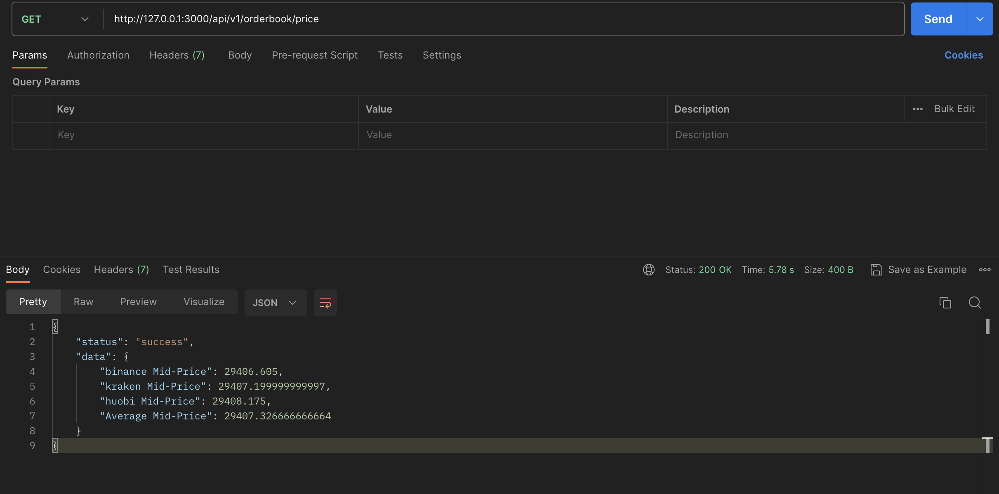
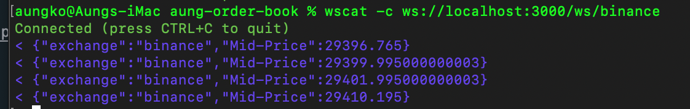

# API Documentation

## Table of Contents

-   [OrderBook Mid Prices Endpoint](#orderbook-mid-prices-endpoint)
-   [Binance Websocket](#binance-websocket)

## OrderBook Mid Prices Endpoint

1.  After run the application, use the following command to add users:

        Endpoint: http://127.0.0.1:3000/api/v1/orderbook/price
        Method: GET
        Possible Status codes: 200, 500
        Response Body: refer to the screenshot sample below

    

## Binance Websocket

1.  After running npm start, run the following command in different terminal to fetch Binance order book with websocket
    NB: I used setInterval() since I cannot generate API_KEY and SECRET_KEY from my binance account (not available in Singapore). Consequently, I'm not able to use ccxt pro version to utilize built-in websocket feature watchOrderBook()

            wscat -c ws://localhost:3000/ws/binance

    
